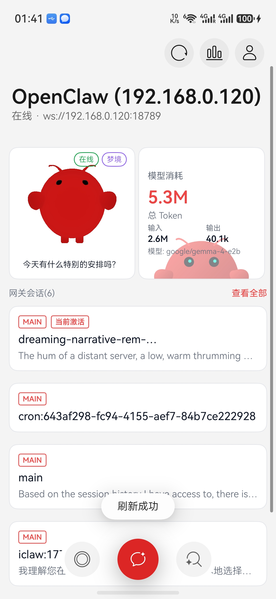
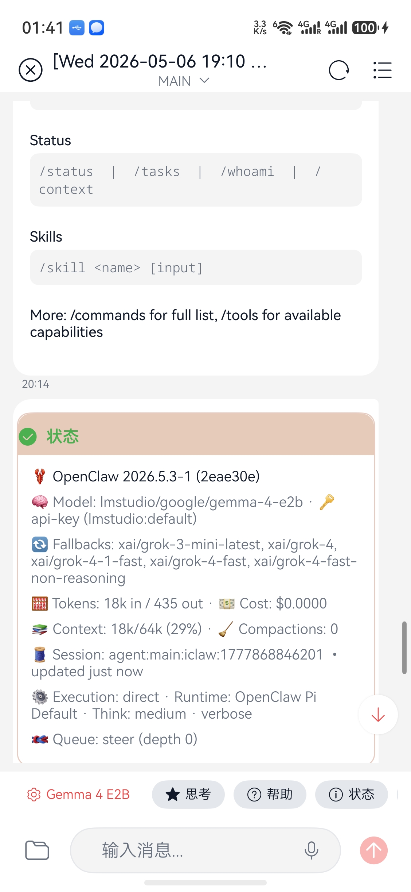
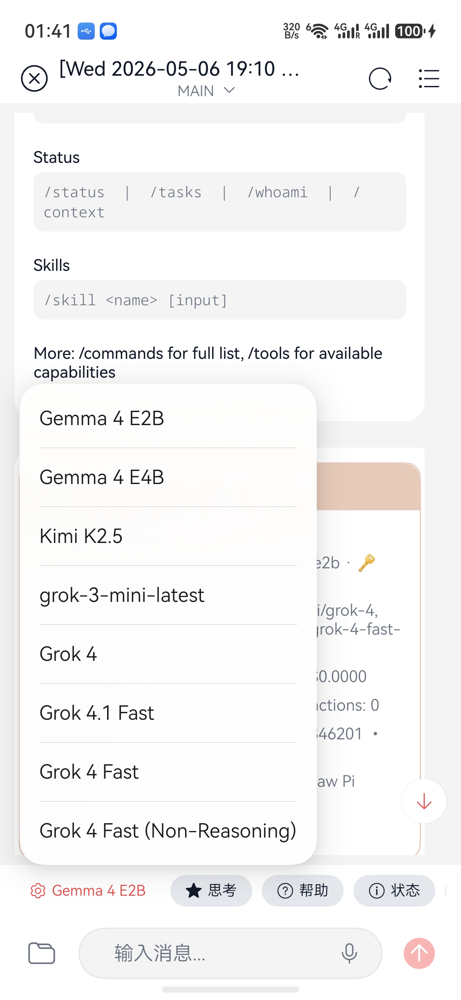
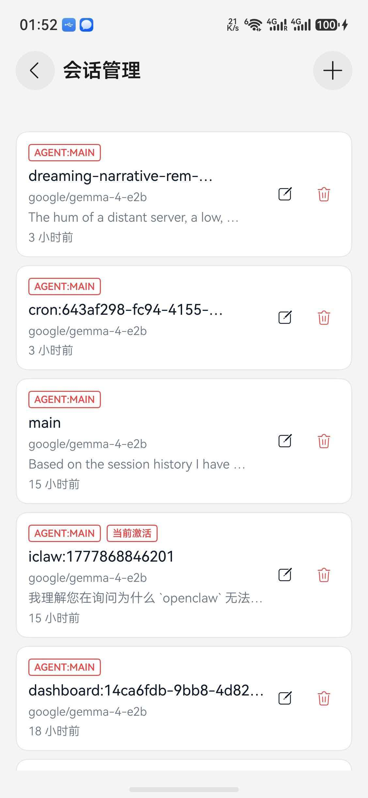
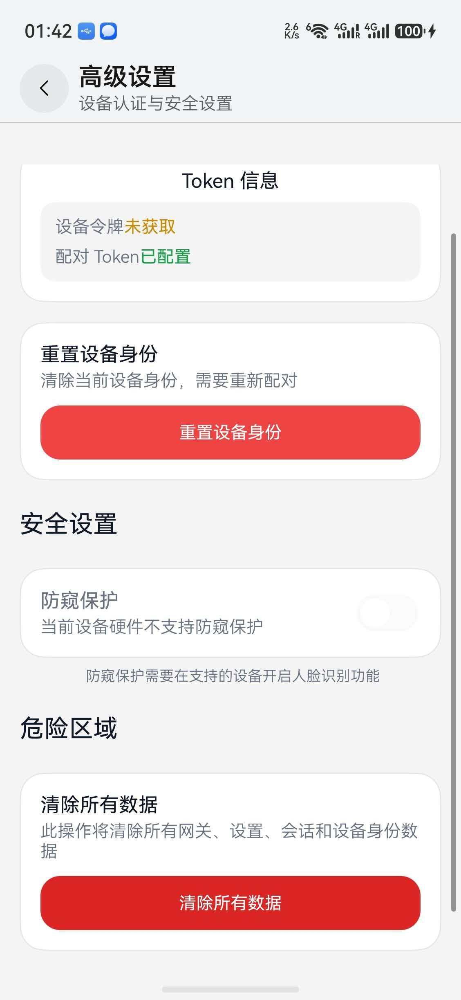

# iClaw - HarmonyOS 项目介绍文档

## 项目基本信息

| 项目 | 信息 |
|------|------|
| **项目名称** | iClaw - OpenClaw 多网关客户端 |
| **开发平台** | HarmonyOS 6.0+ |
| **开发语言** | ArkTS + ArkUI |
| **作品形式** | 原生APP |
| **预览截图** | 见 assets/screenshots/ 目录 |
| **演示视频** | 见 assets/preview.mp4 |

---

## 一、作品形式

### 1.1 技术规格
- ✅ 基于 HarmonyOS 6.0 及以上版本开发
- ✅ 支持 WebSocket 实时通信
- ✅ 支持 RPC 远程调用
- ✅ 安全图库 Media Library Kit（图片选择与上传）
- ✅ AI 防窥保护 Device Security Kit（屏幕隐私检测）
- ✅ 互动卡片/服务卡片 Form Kit（桌面 Widget）
- ✅ UIDesignKit 设计套件（HdsNavDestination 导航）
- ✅ Ark 3D 模型（GLB 模型互动展示）

### 1.2 创新方向使用

本项目使用了 **5个鸿蒙开放Kit能力和其他鸿蒙特性**

| 创新方向 | 使用能力 | 说明 |
|---------|---------|------|
| **全场景一体协同** | 互动卡片/服务卡片 Form Kit | 桌面 Widget 实时显示网关状态，支持手动刷新、定时刷新（30分钟）、网关状态变更自动刷新，跨进程数据同步，一键发送到桌面 |
| **安全隐私保护** | 安全图库 Media Library Kit、AI 防窥保护 Device Security Kit| 图片安全选择、屏幕防窥检测、生物识别应用锁，三重安全防护体系 |
| **AI 原生体验** | WebSocket 流式通信 + RPC 远程调用 | 实时 AI 对话、工具调用可视化、多模型切换、会话级模型配置、流式消息传输 |
| **智能交互设计** | UIDesignKit + ArkUI 声明式 UI | HdsNavDestination 原生导航、Sheet 底部表单、上下文菜单、3D 模型展示 |
| **数据可视化** | 自定义图表组件 | 用量统计面板，展示 Token 消耗、成本分析、热门模型/工具/供应商排行 |

---

## 二、作品内容

### 2.1 创新场景设计

#### 2.1.1 创新功能点与体验优化

**1. 智能网关连接管理**
- **创新点**：实现 OpenClaw 网关的无缝连接与管理，支持 WebSocket 实时通信、RPC 远程调用、Ed25519 签名认证、多网关切换、网关发现与配置
- **体验提升**：用户可通过可视化 Sheet 表单管理多个网关连接，实时查看连接状态、版本信息、设备令牌
- **差异化**：市面上首个 HarmonyOS 原生 OpenClaw 客户端，提供完整的网关操作能力

**2. AI 智能对话系统**
- **创新点**：支持流式消息传输、实时工具调用展示（折叠/展开）、Markdown 渲染、特殊消息卡片（帮助/状态/配置）、思考过程 UI 区分、会话级模型配置、命令系统
- **体验提升**：用户可获得类似 ChatGPT 的流畅对话体验，工具调用过程透明可见，支持详细模式切换
- **差异化**：支持多模型切换、思考模式开关、详细模式，提供比同类产品更丰富的控制选项

**3. AI 用量统计面板**
- **创新点**：可视化展示 AI 使用数据，包括每日 Token 消耗、成本趋势、热门模型/工具/供应商排行、会话级用量统计、用量分析与预测
- **体验提升**：支持按模型和供应商筛选数据，柱状图展示趋势，清晰了解 AI 使用情况
- **差异化**：移动端首个完整的 AI 用量可视化面板，数据实时从网关获取

**4. 桌面服务卡片（Form Kit）**
- **创新点**：实现跨进程数据共享的桌面服务卡片，显示网关状态、支持手动刷新、定时刷新（30分钟）、网关状态变更自动刷新、一键发送到桌面
- **体验提升**：用户无需打开 App 即可查看网关状态，点击卡片可直接启动应用
- **差异化**：使用 Preferences 实现跨进程通信，确保数据实时同步

**5. 隐私与安全保护**
- **创新点**：AI 防窥保护（检测他人窥屏自动隐藏内容）、生物识别应用锁（启动/前台验证）、Ed25519 设备身份认证、安全图库选择
- **体验提升**：聊天时自动检测周围环境，他人靠近时自动隐藏敏感内容；启动应用需要生物识别验证
- **差异化**：移动端首个集成 AI 防窥的 AI 客户端，三重安全防护体系

**6. 会话管理系统**
- **创新点**：支持会话创建、重命名、删除、切换，自动选择默认会话，支持会话级模型配置，会话历史管理
- **体验提升**：提供清晰的会话列表，支持按时间排序、激活状态标记
- **差异化**：支持会话级模型配置、Agent 类型标记，提供细粒度控制

**7. Claw 高级配置**
- **创新点**：支持 Claw 技能管理、定时任务配置、模型列表管理、频道管理、高级设置与自定义配置
- **体验提升**：在手机上即可完整管理 OpenClaw 网关配置，无需切换到电脑端
- **差异化**：移动端首个实现完整 Claw 配置管理的客户端

**8. 梦境模式（Dreaming Mode）**
- **创新点**：实现 AI 记忆梦境处理系统，包含浅梦（Light）、深梦（Deep）、REM 梦境三个阶段，自动进行记忆去重、洞察提取、模式识别
- **体验提升**：可视化展示梦境状态、各阶段运行情况、短期记忆条目、梦境日记内容，支持手动刷新
- **差异化**：移动端首个实现 AI 梦境记忆处理的客户端，将 AI 记忆巩固过程可视化

#### 2.1.2 与同类产品的差异化优势

| 功能 | iClaw | 其他同类产品 |
|------|-------|-------------|
| AI 防窥保护 | ✅ 支持 | ❌ 不支持 |
| 生物识别应用锁 | ✅ 支持 | ❌ 不支持 |
| 桌面 Widget | ✅ 支持 | ❌ 不支持 |
| 用量统计面板 | ✅ 支持 | ❌ 不支持 |
| 工具调用可视化 | ✅ 支持 | ❌ 不支持 |
| 梦境模式 | ✅ 支持 | ❌ 不支持 |
| 多网关同时管理 | ✅ 支持 | ❌ 不支持 |
| Claw 高级配置 | ✅ 支持 | ❌ 不支持 |
| 多模型切换 | ✅ 支持 | ⚠️ 部分支持 |
| 流式消息传输 | ✅ 支持 | ⚠️ 部分支持 |
| 跨平台网关管理 | ✅ 支持 | ❌ 仅 Web |
| HarmonyOS 原生 | ✅ 是 | ❌ 否 |

---

### 2.2 项目详情及用户价值

#### 2.2.1 核心受众人群

| 维度 | 描述 |
|------|------|
| **年龄** | 18-45 岁 |
| **职业** | 开发者、技术爱好者、AI 研究者、系统管理员 |
| **城市** | 一二线城市为主，逐步覆盖全国 |
| **技术背景** | 具备一定的技术基础，熟悉 AI 工具使用 |
| **喜好** | 追求高效工具、喜欢自动化、关注 AI 技术发展 |

#### 2.2.2 具体使用场景

**场景 1：开发者远程管理 AI 网关**
- 开发者在外出时，通过手机快速连接 OpenClaw 网关
- 查看网关状态、模型用量、会话列表
- 通过 AI 对话执行代码操作、文件管理、系统监控

**场景 2：系统管理员监控网关健康**
- 通过桌面 Widget 实时查看网关连接状态
- 快速诊断网关问题，执行重启、配置更新等操作
- 接收网关异常通知，及时处理问题

**场景 3：AI 研究者分析用量成本**
- 通过用量统计面板查看每日 Token 消耗和成本趋势
- 按模型和供应商筛选数据，对比不同 AI 服务的使用情况
- 查看热门工具和模型排行，优化使用策略

**场景 4：隐私敏感场景使用**
- 在公共场所使用 AI 对话时，防窥保护自动检测周围环境
- 他人靠近时自动隐藏聊天内容，保护隐私
- 启动应用需要生物识别验证，防止未授权访问

**场景 5：多网关同时管理**
- 同时管理多个 OpenClaw 网关（开发/测试/生产环境）
- 一键切换网关，独立配置每个网关
- 桌面 Widget 实时显示当前活跃网关状态

**场景 6：移动端随时 AI 对话**
- 在手机上随时随地与 AI 对话
- 支持流式消息、工具调用可视化、会话管理
- 移动端体验不输桌面端

**场景 7：AI 梦境记忆处理**
- 利用空闲时间自动进行 AI 记忆梦境处理
- 浅梦去重、深梦洞察、REM 模式识别
- 让 AI 越用越懂你

**场景 8：Claw 技能与定时任务**
- 在手机上管理 Claw 技能、配置定时任务
- 管理模型列表和频道
- 完整覆盖 OpenClaw 网关运维需求

#### 2.2.3 解决的痛点

| 痛点 | 解决方案 |
|------|---------|
| 移动端缺乏原生 OpenClaw 客户端 | 提供 HarmonyOS 原生应用，完整功能支持 |
| 多网关管理不便 | 支持多网关同时管理，一键切换，独立配置 |
| 网关状态监控不便 | 桌面 Widget 实时显示状态，支持手动/定时/自动刷新 |
| AI 用量不透明 | 可视化用量面板，按模型/供应商筛选 |
| 工具调用不可见 | 可视化展示工具调用过程，支持折叠/展开 |
| 公共场所隐私泄露 | AI 防窥保护，自动检测并隐藏敏感内容 |
| 应用未授权访问 | 生物识别应用锁，启动/前台自动验证 |
| 会话管理混乱 | 清晰的会话列表，支持激活状态标记 |
| 网关配置需电脑端 | 手机端完整管理 Claw 技能、定时任务、模型列表 |

---

### 2.3 HarmonyOS 能力技术集成方案

#### 2.3.1 应用的鸿蒙开放能力与特性

| 能力/特性 | API/组件 | 实现功能 |
|----------|---------|---------|
| **ArkUI 声明式 UI** | `@Component`, `@State`, `@Prop`, `@Link`, `@Builder` | 全页面 UI 开发 |
| **UIDesignKit 导航** | `HdsNavDestination`, `HdsNavigation` | 原生页面导航与路由 |
| **服务卡片** | `FormExtensionAbility`, `FormProvider` | 桌面 Widget |
| **跨进程通信** | `Preferences` | Widget 与 App 数据共享 |
| **网络通信** | `WebSocket`, `http` | 网关连接、API 调用 |
| **设备安全** | `dlpAntiPeep` (DeviceSecurityKit) | AI 防窥保护 |
| **用户认证** | `userAuth` (UserIAMKit) | 生物识别应用锁 |
| **安全图库** | `photoAccessHelper` (MediaLibraryKit) | 图片选择与上传 |
| **Markdown 渲染** | `markdown_hm` | 消息内容格式化 |
| **状态管理** | `AppStorage`, `@StorageLink` | 全局状态管理 |
| **Sheet 表单** | `bindSheet` | 底部弹出表单（网关连接/编辑） |
| **上下文菜单** | `bindMenu` | 用量筛选、操作菜单 |
| **通知服务** | `NotificationService` | 网关状态通知 |
| **SymbolGlyph** | 系统图标库 | 统一图标风格 |

#### 2.3.2 实现的创新功能点

1. **流式消息传输**：使用 WebSocket 实现实时消息流，支持打字机效果
2. **工具调用可视化**：解析工具事件，展示调用过程与结果，支持折叠/展开
3. **思考过程 UI 区分**：对 `<details>` 思考过程内容特殊 UI 处理
4. **跨进程 Widget**：使用 Preferences 实现 App 与 Widget 数据同步，支持手动/定时/自动刷新
5. **AI 防窥保护**：检测设备是否被他人窥视，自动隐藏聊天内容
6. **生物识别应用锁**：启动应用和回到前台时进行身份认证
7. **用量统计面板**：可视化展示 Token 消耗、成本趋势、热门排行
8. **模型/供应商筛选**：支持按模型和供应商过滤用量数据
9. **会话级模型配置**：每个会话可独立配置 AI 模型
10. **智能默认会话**：自动选择最新会话作为默认，支持手动切换
11. **Ed25519 签名认证**：网关连接使用设备身份签名验证
12. **梦境模式可视化**：展示 AI 记忆处理过程，包含浅梦、深梦、REM 三阶段状态和梦境日记
13. **多网关同时管理**：支持同时管理多个 OpenClaw 网关，一键切换、独立配置、状态同步
14. **Claw 高级配置**：支持 Claw 技能管理、定时任务配置、模型列表管理、频道管理
15. **Ark 3D 模型**：使用 GLB 模型展示 OpenClaw 吉祥物 ClawBot，支持互动操作

#### 2.3.3 规范符合性

- ✅ 遵循 ArkTS 5.0+ 语言规范（禁止 any 类型、禁止对象字面量）
- ✅ 使用声明式 UI 开发模式
- ✅ 遵循 HarmonyOS 设计规范
- ✅ 支持深色模式
- ✅ 适配安全区域
- ✅ 使用系统主题颜色
- ✅ 遵循元服务开发规范

---

### 2.4 开源场景化能力应用

#### 2.4.1 应用的开源场景化能力

| 能力 | 说明 | 使用场景 |
|------|------|---------|
| **markdown_hm** | ArkUI 编写的 Markdown 渲染库 | 消息内容格式化显示 |
| **系统 SymbolGlyph** | HarmonyOS 系统图标库 | 统一图标风格 |
| **Preferences** | 系统偏好设置存储 | 配置存储、跨进程通信 |
| **WebSocket** | 系统 WebSocket 实现 | 网关实时通信 |
| **UIDesignKit** | HarmonyOS 设计套件 | 原生导航、Sheet 表单 |
| **dlpAntiPeep** | 设备安全防窥 API | 隐私保护 |
| **userAuth** | 用户认证 API | 生物识别 |

#### 2.4.2 框架可扩展性与可维护性

**架构设计**：
```
iClaw/
├── pages/          # 页面组件（20 个页面）
├── components/     # UI 组件（13 个组件）
├── services/       # 业务服务（11 个服务）
├── store/          # 状态管理（SessionStore, ChatStore）
├── utils/          # 工具函数（ToastUtil, ToolDisplay 等）
├── constants/      # 常量定义（Theme 等）
└── entryformability/ # 服务卡片扩展
```

**可扩展性**：
- ✅ MVVM 架构模式，视图与逻辑分离
- ✅ 单例模式管理服务（GatewayService, WebSocketService 等）
- ✅ 组件化开发，UI 组件可复用（GatewaySheet 统一连接/编辑表单）
- ✅ 接口抽象，支持服务替换
- ✅ 主题系统，支持样式定制

**可维护性**：
- ✅ 统一代码规范（ArkTS 5.0+）
- ✅ 类型安全（严格类型检查，禁止 any）
- ✅ 错误处理（统一异常捕获）
- ✅ 日志系统（hilog 统一日志）
- ✅ 常量管理（Theme 统一管理）

---

### 2.5 可开源共享的技术组件

#### 2.5.1 网关签名验证套件

**组件名称**：`GatewayAuthKit`

**功能描述**：
- 实现 OpenClaw 网关连接的签名验证
- 支持 Ed25519 设备身份生成与管理
- 提供安全的认证流程

**核心代码位置**：
- `entry/src/main/ets/services/GatewayConnectionService.ets`
- `entry/src/main/ets/services/GatewayService.ets`
- `entry/src/main/ets/utils/DeviceIdentityUtil.ets`
- `entry/src/main/ets/utils/Ed25519Signer.ets`

**开源价值**：
- 解决 HarmonyOS 应用与第三方网关安全连接问题
- 提供完整的 Ed25519 认证流程示例
- 可复用于其他需要网关连接的场景

#### 2.5.2 WebSocket RPC 通信框架

**组件名称**：`HarmonyRpcKit`

**功能描述**：
- 基于 WebSocket 的 RPC 通信实现
- 支持请求/响应模式
- 支持事件订阅/发布
- 自动重连机制

**核心代码位置**：
- `entry/src/main/ets/services/WebSocketService.ets`
- `entry/src/main/ets/services/RpcService.ets`

**开源价值**：
- 提供 HarmonyOS 原生 RPC 通信方案
- 支持多种消息类型处理
- 可复用于 IoT、远程控制等场景

#### 2.5.3 跨进程 Widget 数据同步方案

**组件名称**：`WidgetSyncKit`

**功能描述**：
- 使用 Preferences 实现 App 与 Widget 数据同步
- 支持实时状态更新
- 支持跨进程事件通知

**核心代码位置**：
- `entry/src/main/ets/services/WidgetDataService.ets`
- `entry/src/main/ets/entryformability/IClawFormExtensionAbility.ets`

**开源价值**：
- 解决 HarmonyOS Widget 数据同步难题
- 提供完整的跨进程通信示例
- 可复用于其他需要 Widget 的场景

#### 2.5.4 流式消息处理框架

**组件名称**：`StreamKit`

**功能描述**：
- 支持流式消息接收与处理
- 支持打字机效果渲染
- 支持工具事件解析
- 支持工具调用卡片展示

**核心代码位置**：
- `entry/src/main/ets/services/ChatStreamService.ets`
- `entry/src/main/ets/store/ChatStore.ets`
- `entry/src/main/ets/components/ui/ToolCardView.ets`

**开源价值**：
- 提供 HarmonyOS 流式消息处理方案
- 支持多种消息类型
- 可复用于 AI 对话、实时通知等场景

#### 2.5.5 隐私保护套件

**组件名称**：`PrivacyKit`

**功能描述**：
- AI 防窥保护：检测设备是否被他人窥视
- 生物识别应用锁：启动/前台身份认证
- 自动隐藏敏感内容

**核心代码位置**：
- `entry/src/main/ets/services/AntiPeepService.ets`
- `entry/src/main/ets/services/AuthService.ets`
- `entry/src/main/ets/pages/ChatPage.ets`

**开源价值**：
- 提供 HarmonyOS 隐私保护完整方案
- 结合设备安全和用户认证
- 可复用于金融、医疗等隐私敏感场景

#### 2.5.6 代码质量与规范性

| 维度 | 说明 |
|------|------|
| **代码完整性** | 完整实现核心功能，包含 20 个页面、13 个组件、11 个服务 |
| **代码准确性** | 通过编译验证，无语法错误 |
| **代码规范性** | 遵循 ArkTS 5.0+ 规范，严格类型检查，禁止 any |
| **注释完整性** | 关键函数包含注释说明 |
| **错误处理** | 统一异常捕获，提供用户友好提示 |

---

### 2.6 项目相关图片/Demo

#### 2.6.1 应用截图

| 页面 | 截图 |
|------|------|
| 首页 |  |
| AI 对话 |  |
| 模型选择 |  |
| 会话管理 |  |
| 用量统计 |  |
| 用量筛选 |  |
| 桌面 Widget |  |
| 模型管理 |  |
| 高级设置 |  |
| 网关连接 |  |
| 梦境模式 |  |
| 防窥保护 |  |
| 应用锁 |  |
| 深色模式 |  |

#### 2.6.2 Demo 演示

- **演示视频**：assets/preview.mp4
- **项目介绍文档**：项目介绍.html（浏览器打开）

---

## 三、技术架构概览

### 3.1 核心模块

```
┌─────────────────────────────────────────────────────────────┐
│                         UI 层                                │
│  HomePage │ ChatPage │ SessionsPage │ UsagePage │ MePage │...│
├─────────────────────────────────────────────────────────────┤
│                       组件层                                 │
│  MessageBubble │ ToolCardView │ GatewaySheet │ ClawModel3D  │
├─────────────────────────────────────────────────────────────┤
│                       服务层                                 │
│  GatewayService │ ChatStreamService │ AntiPeepService │ ...  │
├─────────────────────────────────────────────────────────────┤
│                      状态管理层                              │
│  SessionStore │ ChatStore │ AppStorage                      │
├─────────────────────────────────────────────────────────────┤
│                      工具层                                  │
│  ToolDisplay │ ToastUtil │ Theme │ DeviceIdentityUtil       │
└─────────────────────────────────────────────────────────────┘
```

### 3.2 数据流

```
用户操作 → UI 组件 → 服务层 → WebSocket/RPC → 网关服务器
                                      ↓
网关响应 → WebSocket/RPC → 服务层 → 状态管理 → UI 更新
```

### 3.3 关键技术指标

| 指标 | 数值 |
|------|------|
| 页面数量 | 22 个 |
| 组件数量 | 13 个 |
| 服务数量 | 10 个 |
| 代码行数 | 约 20,000+ 行 |
| 支持设备 | 手机（Phone） |
| 最低系统版本 | HarmonyOS 6.0 |

---

## 四、项目总结

### 4.1 创新亮点

1. **首个 HarmonyOS 原生 OpenClaw 客户端**：填补移动端网关管理空白
2. **多网关同时管理**：支持同时管理多个 OpenClaw 网关，一键切换、独立配置、状态同步，手机端核心优势
3. **AI 防窥保护**：检测设备是否被他人窥视，自动隐藏敏感内容
4. **生物识别应用锁**：启动/前台自动身份认证，三重安全防护
5. **用量统计面板**：可视化展示 AI 使用情况，支持模型/供应商筛选
6. **工具调用可视化**：展示 AI 工具调用过程，支持折叠/展开
7. **桌面 Widget**：实现跨进程数据同步，支持手动/定时/自动刷新，一键发送到桌面
8. **流式消息传输**：支持实时 AI 对话，打字机效果
9. **完整的安全认证**：Ed25519 设备身份签名验证
10. **梦境模式**：可视化 AI 记忆处理过程，包含浅梦、深梦、REM 三阶段状态和梦境日记
11. **Claw 高级配置**：手机端完整管理 Claw 技能、定时任务、模型列表、频道
12. **Ark 3D 模型**：使用 GLB 模型展示 OpenClaw 吉祥物 ClawBot，支持互动操作

### 4.2 技术价值

- 提供 HarmonyOS 原生 AI 客户端开发范例
- 展示 WebSocket RPC 通信最佳实践
- 演示跨进程 Widget 数据同步方案（手动/定时/自动刷新）
- 提供流式消息处理框架
- 展示 AI 防窥与生物识别的隐私保护方案
- 展示用量数据可视化方案
- 展示 AI 梦境记忆处理可视化方案
- 展示多网关同时管理方案
- 展示 Ark 3D 模型（GLB）互动方案

### 4.3 商业价值

- 降低 OpenClaw 多网关使用门槛，Hermes Agent后续将支持
- 提供移动端完整网关管理能力
- **多网关同时管理**：手机端核心优势，支持多环境多项目场景
- 支持多场景 AI 应用开发
- 可扩展至 IoT、智能家居等领域
- 隐私保护功能适用于金融、医疗等敏感场景

---

## 五、附录

### 5.1 开发环境

| 项目 | 版本 |
|------|------|
| DevEco Studio | 5.0+ |
| HarmonyOS SDK | 6.0+ |
| ArkTS | 5.0+ |
| 编译工具 | hvigor |

### 5.2 依赖库

| 库名 | 版本 | 用途 |
|------|------|------|
| markdown_hm | 1.0.0 | Markdown 渲染 |

### 5.3 参考鸿蒙文档

- [HarmonyOS SDK 文档](https://developer.huawei.com/consumer/cn/doc/harmonyos-references/ability-arkts)
- [ArkUI 组件文档](https://developer.huawei.com/consumer/cn/doc/harmonyos-references/ui-design-arkts-component)
- [ArkTS 语言规范](https://developer.huawei.com/consumer/cn/doc/harmonyos-guides/arkts-coding-style-guide)
- [设备安全防窥](https://developer.huawei.com/consumer/cn/doc/harmonyos-guides/devicesecurity-dlpantipeep)
- [用户认证](https://developer.huawei.com/consumer/cn/doc/harmonyos-guides/start-authentication)

---

**文档版本**：v2.2  
**最后更新**：2026-05-07  
**作者**：winter
